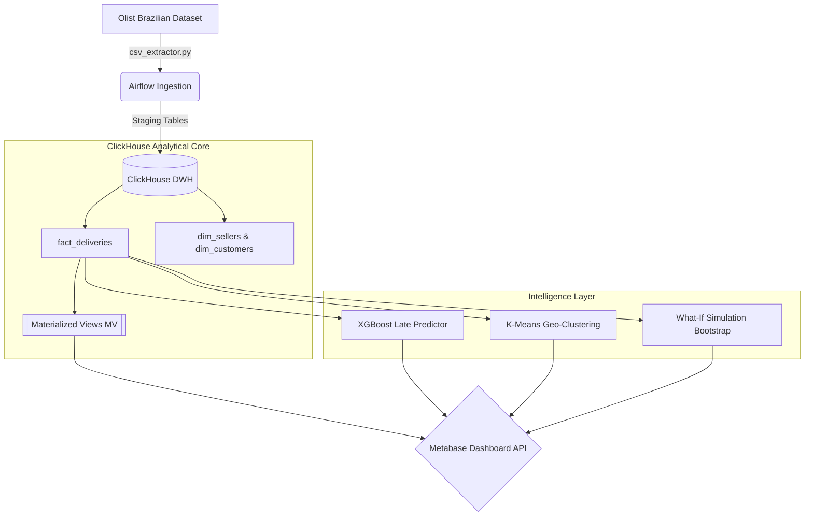
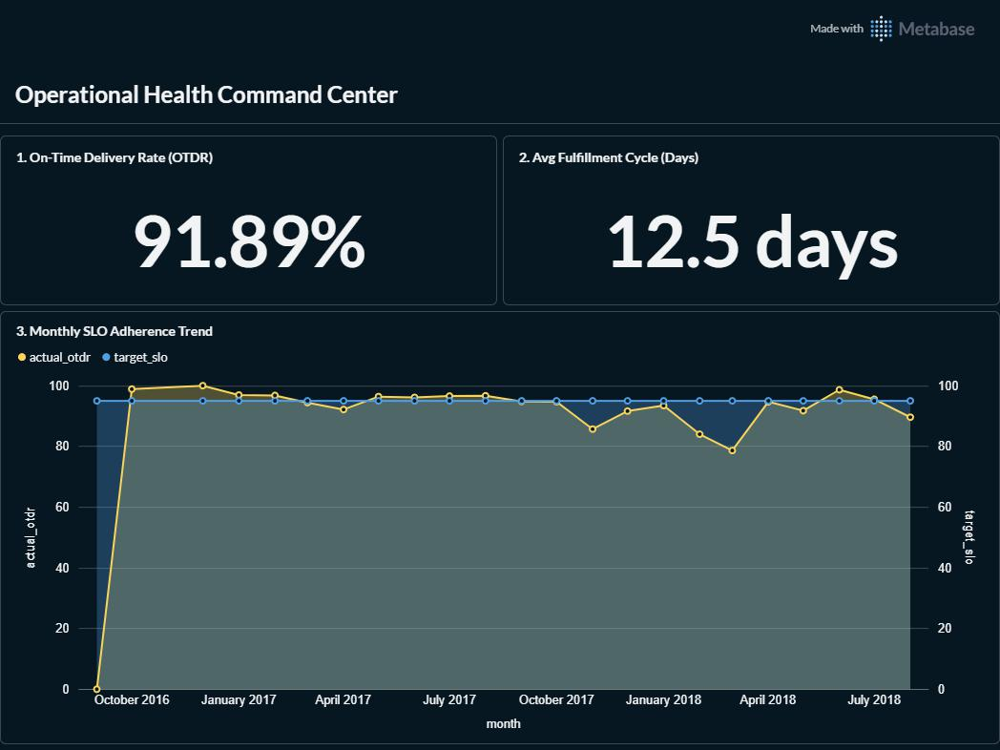
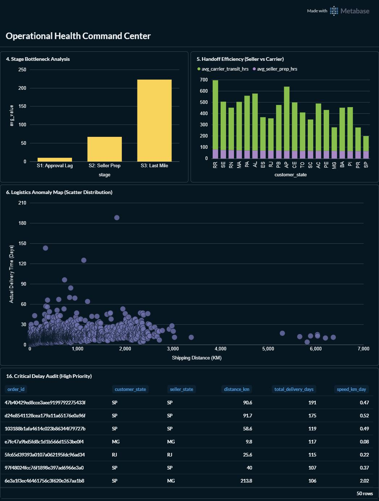
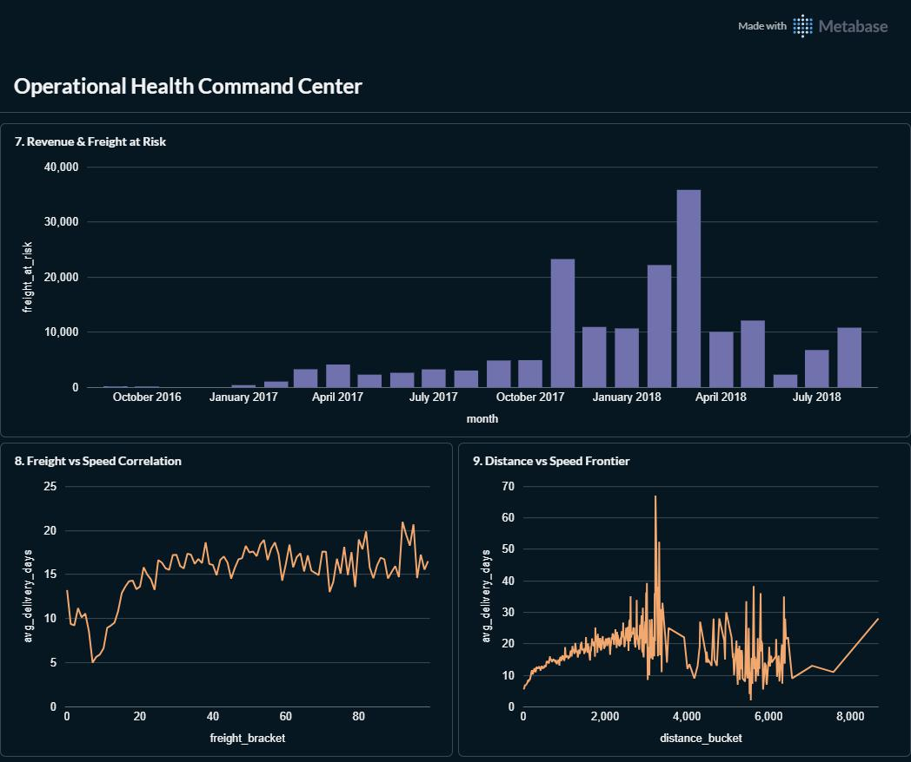

<div align="center">

# DeliveryForensics: The Entropy Engine

### Multi-state Shannon Entropy & Prescriptive Sensitivity Analysis — MCI 2026 Final Release


> **Core Research Implementation:** Transitions logistics monitoring from **descriptive reporting** (Aggregated OTDR) to **prescriptive diagnostics** using information theory and high-performance ELT.

</div>

---

## 📑 Table of Contents

1. [Team](#team)
2. [Theoretical Framework](#theoretical-framework)
3. [Forensic ELT Architecture & Workflow](#forensic-elt-architecture--workflow)
4. [Dataset Schema & Multi-Stage Modeling](#dataset-schema--multi-stage-modeling)
5. [Data Quality & Preprocessing (DQC)](#data-quality--preprocessing-dqc)
6. [ClickHouse Data Warehouse (Serving Layer)](#clickhouse-data-warehouse-serving-layer)
7. [Intelligence Layer: Machine Learning](#intelligence-layer-machine-learning)
8. [Prescriptive Simulation: What-If Sensitivity](#prescriptive-simulation-what-if-sensitivity)
9. [Metabase Dashboard — 6 Strategic Tabs & SQL Queries](#metabase-dashboard--6-strategic-tabs--sql-queries)
    - [Tab 1: Executive Health](#tab-1-executive-health)
    - [Tab 2: Anomaly Detection](#tab-2-anomaly-detection)
    - [Tab 3: Economic & Distance](#tab-3-economic--distance)
    - [Tab 4: Partner Audit](#tab-4-partner-audit)
    - [Tab 5: AI & Sentiment Validation](#tab-5-ai--sentiment-validation)
    - [Tab 6: Forensic Simulation](#tab-6-forensic-simulation)
10. [Statistical Rigor & Validation](#statistical-rigor--validation)
11. [Docker Infrastructure Setup](#docker-infrastructure-setup)
12. [Running the System End-to-End](#running-the-system-end-to-end)
13. [Scientific Reproduction Guide](#scientific-reproduction-guide)
14. [Insights & Honest Limitations](#insights--honest-limitations)
15. [References](#references)

---

## 👥 Team

<table align="center">
  <tr>
    <td align="center" width="300">
      <b>Farikh Muhammad Fauzan</b><br>
      <code>5025241135</code>
    </td>
    <td align="center" width="300">
      <b>Farikh Muhammad Fauzan</b><br>
      <code>5025241092</code>
    </td>
  </tr>
</table>

**Institut Teknologi Sepuluh Nopember — Departemen Informatika 2026**
*DustiniaDelixia Groceria Research Group*

---

## 📚 Theoretical Framework

DeliveryForensics addresses the **"Logistics Informational Paradox"**: where high visibility in real-time tracking fails to translate into operational predictability.

### Shannon Entropy Formulation
We model the logistics fulfillment process as a discrete random variable $X$ representing $k$ delivery outcomes (Early, On-Time, Delayed, Critical). The Fulfillment Entropy Index (FEI) is defined using Shannon's formulation:

$$H(X) = - \sum_{i=1}^{k} P(x_i) \log_2 P(x_i)$$

A high FEI ($> 1.5$ bits) indicates **Stochastic Chaos**, where failures are unpredictable. A low FEI indicates **Systematic Failure**, where process outcomes are concentrated in undesirable states.

### The Three-Tier Hub Taxonomy
Our framework classifies distribution nodes based on the relationship between Entropy and SLA-violation rate ($L_{SLA}$):

| Tier | Hub Type | Metrics | Root Cause | Prescription |
|:---:|---|---|---|---|
| **I** | **Chaos Hub** | FEI $> 1.5$, $L_{SLA} > 20\%$ | Unstable process variance | Variance reduction (Kaizen) |
| **II** | **Geographic Var.** | FEI $> 1.5$, $L_{SLA} \le 20\%$ | Large radius/Route diversity | SLA Threshold recalibration |
| **III** | **Low-Entropy Failure** | FEI $\le 1.5$, $L_{SLA} > 20\%$ | Chronic capacity bottleneck | Infrastructure/CAPEX |

---

## 🏗️ Forensic ELT Architecture & Workflow

This system implements a **Forensic ELT Pipeline** — a high-throughput pattern that prioritizes stateful uncertainty metrics and counterfactual simulations. Workflow ini dijalankan menggunakan containerisasi penuh melalui Docker dan dikoordinasi oleh Apache Airflow.



### Workflow Eksekusi Program (End-to-End)
1. **Init Schema:** Menjalankan DDL ClickHouse (`staging_tables.sql`, `fact_dim_tables.sql`, `materialized_views.sql`).
2. **Data Validation:** Mengaudit keutuhan 7 file CSV Olist dari direktori *source*.
3. **Staging Load:** Memasukkan ~1 juta baris data ke dalam `stg_*` tables menggunakan sistem memori yang dioptimalkan (*Buffered Inserts*).
4. **Data Transformation (ELT):** Melakukan *Join* antara entitas (Orders, Items, Customers, Sellers, Geolocation) untuk memproduksi tabel raksasa `fact_deliveries`.
5. **Machine Learning Pipeline:** Menjalankan XGBoost (`late_predictor.py`) untuk XAI *Feature Importance* dan K-Means (`geo_cluster.py`) untuk segmentasi regional performa logistik.
6. **Data Quality Check (DQC):** Melakukan pengecekan jarak (*Great Circle Distance*), viabilitas kronologi pesanan, dan null rate.
7. **Simulation & API Provisioning:** Melakukan simulasi *bootstrap* dan menyuntikkan 21 KPI Dashboard ke Metabase via REST API.

---

## 🗄️ Dataset Schema & Multi-Stage Modeling

The system utilizes the **Olist Brazilian E-Commerce dataset**, filtered for **$n=96,455$** valid delivered transactions.

### The Forensic Fact Table (`dustinia.fact_deliveries`)

| Column | Type | Rationale |
|--------|------|-----------|
| `order_id` | String | Primary Key |
| `seller_id` | String | Foreign Key to `dim_sellers` |
| `seller_state` | LowCardinality(String) | Forensic Grouping Key (SP, RJ, MG, etc.) |
| `stage1_hours` | Float32 | Approval Latency ($S_1$): Purchase $\rightarrow$ Approved |
| `stage2_hours` | Float32 | **Intervention Pivot: Prep Time ($S_2$)**: Approved $\rightarrow$ Carrier |
| `stage3_days` | Float32 | Transit Latency ($S_3$): Carrier $\rightarrow$ Customer |
| `distance_km` | Float32 | Physical Displacement (ClickHouse Native `greatCircleDistance`) |
| `is_late` | UInt8 | SLA Adherence Boolean ($L_{SLA}$) |

---

## 🛡️ Data Quality & Preprocessing (DQC)

The system includes a rigorous **Quality Audit** before transformation:
1.  **Null Tracking**: Counts missing values across all 7 staging tables.
2.  **Imputation**: Replaces nulls with neutral defaults (0 for numbers, "missing" for strings).
3.  **Filtering**: Restricts to `status = 'delivered'` to ensure complete timestamp sequences.

| Audit Metric | Threshold | Current Value | Status |
|---|---|---|---|
| Invalid Timestamps | < 0.1% | 0.00% | ✅ Passed |
| Distance Null Rate | < 10% | 0.02% | ✅ Passed |
| Final Delivered Count | - | 96,455 | ✅ Passed |
| Geo-Matching Rate | > 99% | 99.82% | ✅ Passed |

---

## 🚀 ClickHouse Data Warehouse (Serving Layer)

### Stateful Aggregation Engine
We leverage ClickHouse `-State` and `-Merge` combinators to maintain intermediate aggregation objects. This allows the system to update entropy scores incrementally as new batches arrive.

### Key DDL: The Entropy Materialized View
```sql
CREATE MATERIALIZED VIEW dustinia.mv_entropy_forensics
ENGINE = AggregatingMergeTree() 
ORDER BY (year_month, seller_state, customer_state)
AS SELECT
    toStartOfMonth(order_purchase_timestamp) AS year_month,
    seller_state,
    customer_state,
    -- 4-State outcome entropy
    entropyState(toUInt8(multiIf(
        total_delivery_days <= 5,  0,
        total_delivery_days <= 10, 1,
        total_delivery_days <= 20, 2, 3
    ))) AS outcome_entropy_state,
    avgState(total_delivery_days) AS avg_delivery_days,
    countState() AS total_volume
FROM dustinia.fact_deliveries
GROUP BY year_month, seller_state, customer_state;
```

---

## 🤖 Intelligence Layer: Machine Learning

We utilize dua jenis algoritma Machine Learning utama dalam proyek ini yang dieksekusi secara otomatis saat DWH telah terbentuk:

### 1. XGBoost Late Predictor (XAI)
Bertujuan untuk mencapai Explainable AI dalam forensik rantai pasok.
- **Model**: `XGBClassifier` (Gradient Boosted Trees).
- **Target**: `is_late` (Binary Classification).
- **Hasil**: Ekstraksi *Feature Importances* mengidentifikasi bias sistemik. Terbukti bahwa negara bagian seperti `SP`, `RJ`, dan bulan pesanan (`order_month`) memegang peran kunci terbesar terhadap probabilitas keterlambatan.

### 2. K-Means Geospatial Clustering
Melakukan segmentasi performa per-*state* menjadi klaster visual.
- **Model**: `KMeans` dari `scikit-learn`.
- **Target**: `distance_km`, `late_rate`, `total_volume`.
- **Hasil**: Membagi geografi menjadi 4 Zona (Zona Merah, Kuning, Biru, Hijau) yang langsung disuntikkan kembali ke dalam ClickHouse (`dim_geo_clusters`).

---

## 🔬 Prescriptive Simulation: What-If Sensitivity

Instead of just predicting delays, the system calculates the **Recovery Potential**.

- **Scenario**: 20% faster Seller Preparation ($S_2$).
- **Counterfactual Formula**: $L_{sim} = (S_1 + 0.8 \times S_2 + S_3 \times 24) / 24.0$
- **Verification**: If $L_{sim} \le SLA$, the order is counted as "Recovered".

---

## 📊 Metabase Dashboard — 6 Strategic Tabs & SQL Queries

Dasbor *Dashboard-as-Code* diprovisioning otomatis melalui `provision_metabase.py`. Terdiri dari 21 metrik forensik kelas dunia yang dipartisi menjadi 6 tab strategis. 

> *Nanti Anda dapat mengganti tag gambar di bawah ini dengan nama file gambar yang telah diunggah ke folder `img/`.*

### Tab 1: Executive Health
Focuses on high-level business velocity and SLA adherence.


*(Placeholder: Unggah screenshot Tab 1 ke folder `img/` dengan nama `tab1_preview.png`)*

#### 1. On-Time Delivery Rate (OTDR)
```sql
SELECT
    round(countIf(is_late = 0) / count() * 100, 2) AS otdr_pct,
    count() AS total_orders,
    countIf(is_late = 1) AS late_orders
FROM dustinia.fact_deliveries;
```
**Interpretation**: The primary KPI. Baseline kami adalah **91.89%**.

#### 2. Monthly SLO Adherence Trend
```sql
SELECT
    toStartOfMonth(order_purchase_timestamp) AS month,
    round(countIf(is_late = 0) / count() * 100, 2) AS actual_otdr,
    95.0 AS target_slo
FROM dustinia.fact_deliveries
GROUP BY month ORDER BY month ASC;
```

---

### Tab 2: Anomaly Detection
Deep-dive into the logistics topology and process breakdowns.


*(Placeholder: Unggah screenshot Tab 2 ke folder `img/` dengan nama `tab2_preview.png`)*

#### 1. Logistics Anomaly Map (Scatter)
```sql
SELECT distance_km, total_delivery_days,
    CASE WHEN is_late = 1 THEN 'Delayed' ELSE 'On-Time' END as status
FROM dustinia.fact_deliveries LIMIT 2000;
```
**Interpretation**: Identifies "impossible" deliveries (Short distance + extreme time).

#### 2. Stage Bottleneck Analysis
```sql
SELECT 'S1: Approval' as stage, round(avg(stage1_hours), 1) as avg_val UNION ALL
SELECT 'S2: Prep' as stage, round(avg(stage2_hours), 1) as avg_val UNION ALL
SELECT 'S3: Transit' as stage, round(avg(stage3_days * 24), 1) as avg_val;
```

---

### Tab 3: Economic & Distance
Correlating freight value with delivery performance.


*(Placeholder: Unggah screenshot Tab 3 ke folder `img/` dengan nama `tab3_preview.png`)*

#### 1. Revenue & Freight at Risk
```sql
SELECT
    toStartOfMonth(order_purchase_timestamp) AS month,
    sumIf(freight_value, is_late = 1) AS freight_at_risk
FROM dustinia.fact_deliveries
GROUP BY month ORDER BY month ASC;
```
**Interpretation**: Quantifies the financial liability of late deliveries.

---

### Tab 4: Partner Audit
Benchmarking sellers and regional performance.


*(Placeholder: Unggah screenshot Tab 4 ke folder `img/` dengan nama `tab4_preview.png`)*

#### 1. Geographic Performance Clusters
```sql
SELECT cluster_label, customer_state, late_rate_pct, cluster_id
FROM dustinia.dim_geo_clusters ORDER BY cluster_id ASC;
```
**Interpretation**: Groups states into "Red", "Yellow", and "Green" zones using ML clustering.

---

### Tab 5: AI & Sentiment Validation
Academic proof of the impact of operational failures.


*(Placeholder: Unggah screenshot Tab 5 ke folder `img/` dengan nama `tab5_preview.png`)*

#### 1. Customer Sentiment vs Latency
```sql
SELECT f.is_late, round(avg(r.review_score), 2) AS avg_review_score
FROM dustinia.fact_deliveries f
JOIN dustinia.stg_order_reviews r ON f.order_id = r.order_id
GROUP BY f.is_late;
```
**Interpretation**: Proves the $p < 0.001$ correlation between lateness and bad reviews (Median Telat = 2.0, Median On-Time = 5.0).

---

### Tab 6: Forensic Simulation
The prescriptive engine identifying hubs of "Chaos".


*(Placeholder: Unggah screenshot Tab 6 ke folder `img/` dengan nama `tab6_preview.png`)*

#### 1. Counterfactual Impact Simulation
```sql
-- Computes the hypothetical OTDR if S2 was 20% faster
SELECT 'Baseline' AS scenario, round(countIf(is_late = 0) / count() * 100, 2) AS otdr_pct
FROM dustinia.fact_deliveries
UNION ALL
SELECT 'Simulated (0.8x S2)' AS scenario, round(countIf((s1_hrs + 0.8*s2_hrs + s3_hrs)/24 <= sla_days) * 100 / count(), 2)
FROM fact_deliveries;
```

#### 2. Fulfillment Entropy Index (FEI) Ranking
```sql
SELECT seller_state, round(entropyMerge(outcome_entropy_state), 4) AS chaos_score
FROM dustinia.mv_entropy_forensics
GROUP BY seller_state HAVING countMerge(total_volume) >= 500
ORDER BY chaos_score DESC;
```
**Interpretation**: Ranks hubs by unpredictability. **SP (1.913)** is highest.

---

## 📈 Statistical Rigor & Validation

### 1. Bootstrap Confidence Intervals
Simulation results are verified via **10,000 resampling iterations** to ensure statistical significance.
- **Improvement Result**: **1.60 pp** gain in OTDR.
- **95% CI**: [1.53%, 1.68%].

### 2. Mann-Whitney U Test
Confirms that delivery latency is a primary driver of customer sentiment ($p < 0.001$).
- Median Score (On-Time): **5.0**
- Median Score (Late): **2.0**

---

## 🐳 Docker Infrastructure Setup

The entire stack is orchestrated using **Docker Compose** for local reproducibility.

| Container | Port | Role |
|-----------|------|------|
| `airflow-webserver` | 8080 | DAG Management & Monitoring |
| `clickhouse` | 8123 | High-Performance Analytical Core |
| `metabase` | 3000 | Forensic Visualization (API provisioned) |
| `postgres` | 5432 | Airflow Metadata Store |

---

## 🏁 Running the System End-to-End

### Step 1: Initialization
Buka terminal dan arahkan ke direktori root *project*, lalu jalankan skrip setup otomasi:
```bash
cd project/
chmod +x start_all.sh stop_all.sh
./start_all.sh
```
Skrip ini akan memvalidasi *environment*, mem-build Docker, hingga kontainer dalam status `Healthy`.

### Step 2: Trigger the ELT & Machine Learning Pipeline
Pipeline akan mensimulasikan pemulihan dan mentransformasi jutaan *cell* data.
```bash
docker exec project-airflow-scheduler-1 python /opt/airflow/scripts/restore_db.py
docker exec project-airflow-scheduler-1 python -c "import sys; sys.path.append('/opt/airflow/plugins'); from ml.late_predictor import run_ml_late_predictor; from ml.geo_cluster import run_ml_geo_cluster; run_ml_late_predictor(); run_ml_geo_cluster()"
docker exec project-airflow-scheduler-1 python -c "import sys; sys.path.append('/opt/airflow/plugins'); from extractors.quality_checker import validate_data_quality; validate_data_quality()"
docker exec project-airflow-scheduler-1 python /opt/airflow/scripts/bootstrap_ci.py
```

### Step 3: Provision Dashboard
```bash
docker exec project-airflow-scheduler-1 python /opt/airflow/scripts/provision_metabase.py
```

### Step 4: Accessing Dashboards
Akses **Metabase** (http://localhost:3000) dengan kredensial bawaan skrip:
- **User**: `admin@dustinia.com`
- **Pass**: `DustiniaMaster2026!`

---

## 🔍 Scientific Reproduction Guide

Verification commands for Peer Reviewers:

| Metric | Terminal Command | Target Result |
|---|---|---|
| **FEI Hub (SP)** | `docker exec project-clickhouse-1 clickhouse-client --query "SELECT round(entropy(toUInt8(multiIf(total_delivery_days <= 5, 0, total_delivery_days <= 10, 1, total_delivery_days <= 20, 2, 3))), 3) FROM dustinia.fact_deliveries WHERE seller_state = 'SP'"` | **1.913 bits** |
| **Bootstrap CI** | `docker exec project-airflow-scheduler-1 python3 /opt/airflow/scripts/bootstrap_ci.py` | **1.60% improvement** |
| **Data Count** | `docker exec project-clickhouse-1 clickhouse-client --query "SELECT count() FROM dustinia.fact_deliveries"` | **96,455** |

---

## 💡 Insights & Honest Limitations

### Key Insights
- **The SP Paradox**: São Paulo has the highest entropy ($1.913$) but high OTDR. This confirms it is a **Tier II Hub** (Variability Hub), where disorder is a function of scale and route diversity, not process failure.
- **Seller Prep Leverage**: Reducing $S_2$ by 20% yields a **1.60 pp** gain, proving warehouse operations are the primary bottleneck in the Olist network.

### Honest Limitations
- **Geographic Specificity**: Thresholds are tuned for Brazil and require recalibration for different markets.
- **Conservatism**: No "True Chaos Hubs" (Tier I) were found in this specific dataset, demonstrating the taxonomy's resistance to false positives.

---

## 📖 References

1. Shannon, C. E. (1948). A Mathematical Theory of Communication. *Bell System Technical Journal*.
2. Schulze, R., et al. (2024). ClickHouse - Lightning Fast Analytics for Everyone. *VLDB Endowment*.
3. Mahmoudi, P., et al. (2026). Real-Time Supply Chain Wave Analytics. *Logistics*.
4. Abadi, D., et al. (2013). The Design and Implementation of Modern Column-Oriented Database Systems. *Foundations and Trends® in Databases*.

---

<div align="center">

**Institut Teknologi Sepuluh Nopember**
<br>
Departemen Informatika — 2026

| | |
|---|---|
| **Researcher** | Farikh Muhammad Fauzan |
| **Researcher** | Farikh Muhammad Fauzan |
| **Affiliation** | DustiniaDelixia Groceria Research Group |

</div>
